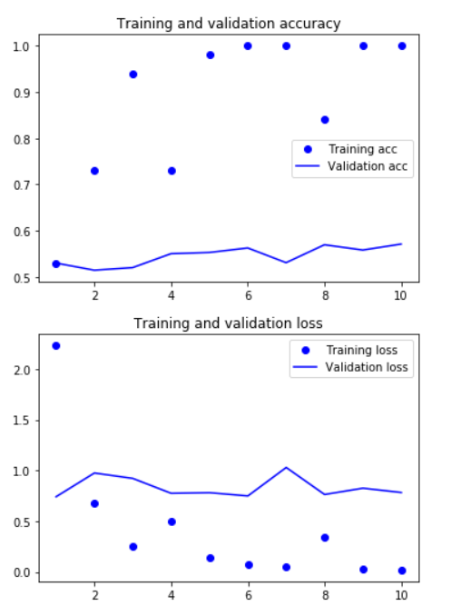

# **Neural Word Embeddings**

## `TSAI EVA - Phase 2 - Session 1`

## IMDB movie-review sentiment-prediction

1. **Learning word embeddings with embedding layer**

   The network will learn 8-dimensional embeddings for each of the top 10,000 most common words, turn the input integer sequences (2D integer tensor) into embedded sequences (3D float tensor), flatten the tensor to 2D, and train a single Dense layer on top for classification; To get a validation accuracy of ~75%, which is pretty good considering that we’re only looking at the first 20 words in every review.

   > loss: 0.2821 - acc: 0.8864 - val_loss: 0.5305 - val_acc: 0.7502

2. **Using pre-trained word embeddings**

   Instead of learning word embeddings jointly with the problem which we want to solve, we can load embedding vectors from a pre-computed embedding space which is highly structured and exhibits useful properties.

   The pre-computed databases of word embedding which we are going to use is *Global Vectors for Word Representation* (GloVe) - It has precomputed embeddings for millions of English tokens, obtained from Wikipedia data and Common Crawl data.

   We will use a similar model as above, embedding sentences in sequences of vectors, flattening them, and training a Dense layer on top. But we’ll do so using pre-trained word embeddings; and instead of using the pre-tokenized IMDB data packaged in Keras, we’ll start from scratch by downloading the original text data.

   Here we will be training on 200 samples and validating on 10,000 samples.

   We will be using the 100-dimensional GloVe embedding vectors for 400,000 words (or nonword tokens).

   `Evaluation of model`:

   The model quickly starts overfitting, which is unsurprising given the small number of training samples. Validation accuracy has high variance for the same reason, but it seems to reach ~58% using 200 samples and ~68% using 8000 samples for training.

   > loss: 0.0257 - acc: 0.9925 - val_loss: 1.7110 - val_acc: 0.6850

   *Results for training with 200 samples*

   

   *Results for training with 8000 samples*

   

3. **Training the same model without pretrained word embeddings**

   Train the same model without loading the pre-trained word embeddings and without freezing the embedding layer. In that case, we’ll learn a task-specific embedding of the input tokens, which is generally more powerful than pre-trained word embeddings when lots of data is available.

   > loss: 1.0984e-07 - acc: 1.0000 - val_loss: 1.0149 - val_acc: 0.8136

   *Results for training with 200 samples*

   

   *Results for training with 8000 samples*

   

   Validation accuracy is ~ 50% using 200 samples and ~80% using 8000 samples. 

**Finally, let’s evaluate the model on the test data.**

While evaluating the model on the test set we get a test accuracy of 67.9%

> ​	[1.6826075435256957, 0.67908]

